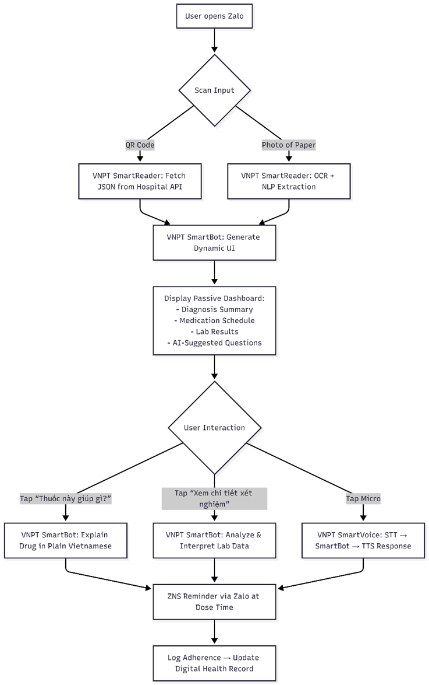
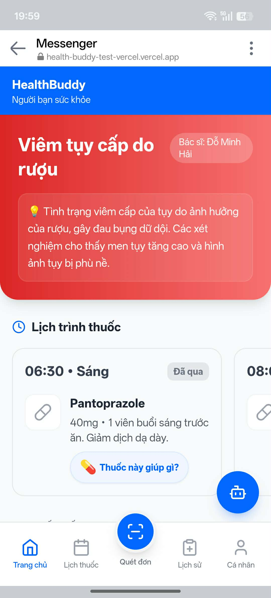
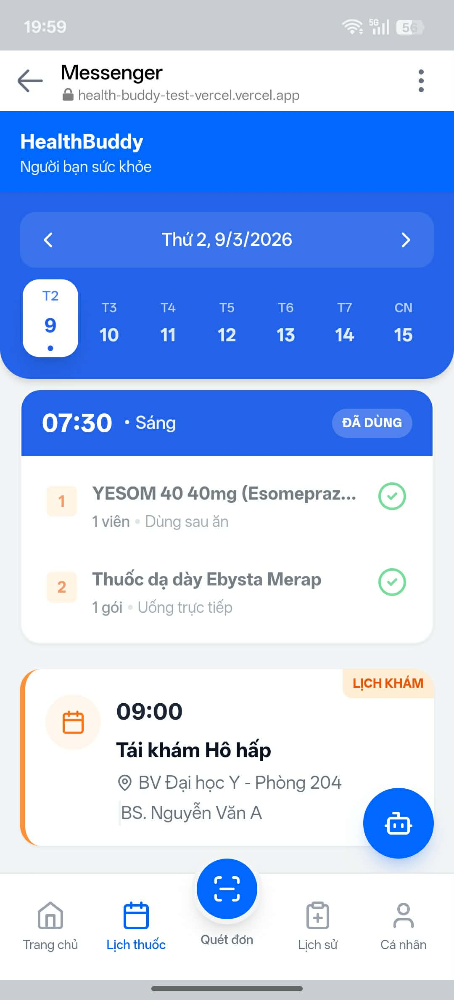
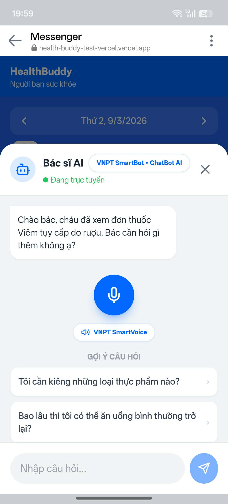
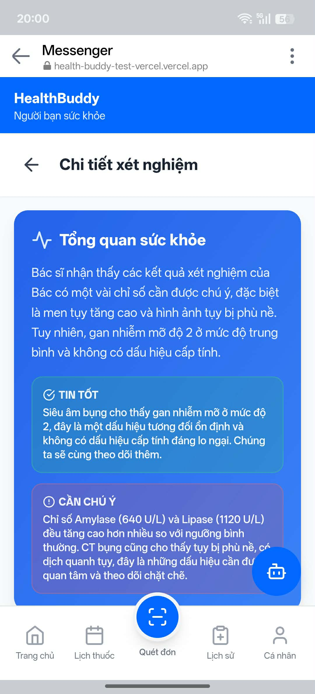

# HealthBuddy (Web Prototype)

HealthBuddy is a **demo prototype** built for **VNPT AI Hackathon 2025**.

This project focuses on:

- Frontend concept and interaction design.
- Communicating the product idea clearly.
- Simulating AI-assisted healthcare support for elderly users.

It is not a production system and is intended for presentation and validation of the idea.

## Live Demo and Design

- Online demo (web - still active): https://health-buddy-test-vercel.vercel.app/
- YouTube demo: https://youtu.be/VJJ9zZod4-g
- Figma: [Figma Design link](https://www.figma.com/design/SVNMM2AjrXWRMebZfWjlzv/Wireframe-R1?node-id=0-1&t=Hw8poJ29vzNUMzGl-1)
- Proposal PDF: [Proposal link](https://drive.google.com/file/d/1uiPeeySEgSBXo7OVvoG5ZWbfDAglWk7x/view?usp=sharing)

## Hackathon Context

According to the proposal/report, the concept emphasizes:

- Passive healthcare experience ("do not ask, just serve").
- Elderly-friendly interactions inside familiar digital behavior.
- A core user flow from empty state to an AI-generated health dashboard.
- VNPT AI-centered architecture and integration strategy.

## Key Features in This Prototype

- Mobile-first healthcare UI with bottom navigation and chat entry point.
- Scan/Input page to simulate document ingestion (manual text + demo scenarios).
- AI parsing of prescription/lab text into **dynamic UI JSON**.
- Dynamic home rendering:
  - Summary card
  - Medication schedule (morning/noon/evening/as-needed)
  - Info list for lab-like data
  - Text advice blocks
- AI-enriched drug explanations and suggested follow-up questions.
- AI chat modal with contextual answers from current patient data.
- Basic calendar/history screens to demonstrate the broader product direction.

## Gemini API Usage

This prototype uses **Google Gemini API** via `@google/generative-ai`.

- Service file: `src/services/gemini.js`
- Model in current code: `gemini-2.5-flash-lite`
- Main AI functions:
  - `parsePrescription(...)`
  - `enrichDrugInfo(...)`
  - `generateMoreQuestions(...)`
  - `analyzeLabResults(...)`
  - `explainLabResult(...)`
  - `chat(...)`

If no API key is configured, the app falls back to mock/demo responses.

## System Flow

This flow combines the implemented frontend behavior and the report's architecture direction.

1. User opens app in empty state.
2. User goes to **Scan** and provides input:
   - Manual text/JSON, or
   - Demo scenario data (simulating OCR/ingestion).
3. Frontend sends content to Gemini parsing service.
4. Gemini returns structured JSON for UI composition.
5. App stores parsed result in local state + localStorage.
6. Home screen renders dynamic modules from returned JSON.
7. User can:
   - Tap medicine items for AI explanation.
   - Ask suggested questions.
   - Open chat modal for contextual Q&A.
8. Additional modules/pages (lab details, calendar, history) demonstrate the extended product journey.

### System Flow Diagram



## Screenshots

### Home/UI Preview (Table)

| Screen 1                                    | Screen 2                                      |
| ------------------------------------------- | --------------------------------------------- |
|      |        |
|  |  |

## Tech Stack

- React 18
- Vite 5
- Tailwind CSS 3
- React Router DOM 6
- Lucide React
- Google Generative AI SDK (`@google/generative-ai`)

## Project Structure (Main Parts)

- `src/pages/`: main screens (`HomePage`, `ScanPage`, `LabResultsPage`, etc.)
- `src/components/`: shared and feature components (`ChatModal`, home modules)
- `src/context/AppContext.jsx`: app state and localStorage persistence
- `src/services/gemini.js`: all generative AI interactions
- `src/data/demo_scenarios.json`: demo data used for prototype scenarios
- `scripts/generate_qr.js`: utility to generate QR images from demo scenarios

## Getting Started

### 1. Install dependencies

```bash
npm install
```

### 2. Configure environment variable

Create a `.env` file in the project root:

```env
VITE_GEMINI_API_KEY=your_gemini_api_key_here
```

### 3. Run development server

```bash
npm run dev
```

### 4. Build for production

```bash
npm run build
```

## Prototype Scope and Limitations

- This is a **hackathon demo prototype**, not a clinical product.
- OCR/camera and hospital integration are represented conceptually in this web version.
- Several pages (for example profile/history depth) are simplified for storytelling.
- AI outputs are generated and should not be treated as medical diagnosis.

## Notes on Report Alignment

The included proposal PDF outlines broader strategy and roadmap, including:

- Problem/market framing
- Solution vision and core user flow
- VNPT AI integration and system architecture
- Business model, risk mitigation, and implementation roadmap

This repository implements the frontend prototype layer that demonstrates that vision.
